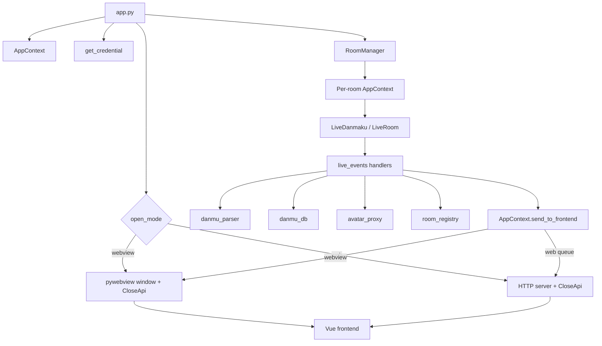
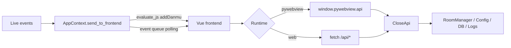
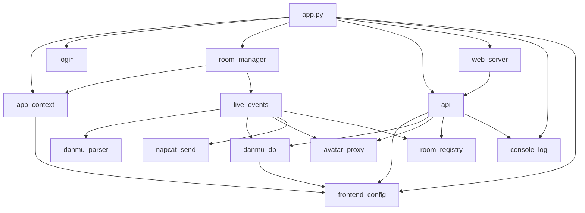
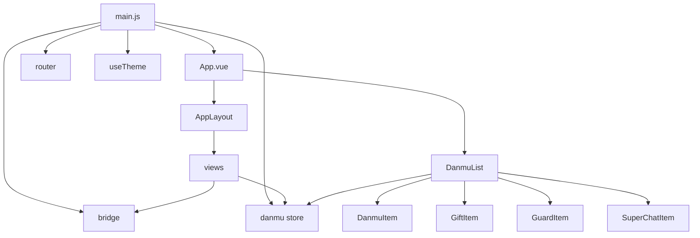

# Code Wiki

## 1. Project Overview

`RunLiveTest` is a Bilibili live-room companion application built with a Python backend and a Vue 3 frontend.

It supports:

- real-time danmaku, gift, guard, and super chat event display
- local desktop runtime through `pywebview`
- browser runtime through a built-in HTTP server
- room-based configuration and multi-room on-demand listening
- SQLite persistence for danmaku and gift records
- QQ group notification via NapCat
- theme switching, window presets, and lightweight analytics/data panels

At a high level, the repository is organized as:

- `app.py`: runtime entrypoint
- `src/`: Python backend modules
- `frontend/`: Vue 3 single-page application
- `scripts/`: maintenance and migration scripts
- `tests/`: focused Python tests
- `config.json` / `theme.json`: runtime configuration and theme presets

## 2. Architecture Summary

The application has two runtime modes:

- `webview` mode: launches a frameless desktop window and exposes Python methods to the frontend through `pywebview`
- `web` mode: starts a local HTTP server, serves `frontend/dist`, and exposes REST APIs plus a polled event queue

### 2.1 High-Level Flow



### 2.2 Frontend Communication Modes



## 3. Repository Structure

```text
runlivetest/
|-- app.py
|-- src/
|   |-- __init__.py
|   |-- api.py
|   |-- app_context.py
|   |-- avatar_proxy.py
|   |-- console_log.py
|   |-- danmu_db.py
|   |-- danmu_parser.py
|   |-- frontend_config.py
|   |-- live_events.py
|   |-- login.py
|   |-- napcat_send.py
|   |-- room_manager.py
|   |-- room_registry.py
|   |-- web_server.py
|   `-- analysis/
|-- frontend/
|   |-- package.json
|   |-- vite.config.js
|   `-- src/
|       |-- App.vue
|       |-- main.js
|       |-- api/bridge.js
|       |-- components/
|       |-- composables/
|       |-- layout/
|       |-- router/
|       |-- stores/
|       `-- views/
|-- scripts/
|-- tests/
|-- README.md
|-- config.json
`-- theme.json
```

## 4. Runtime Startup Sequence

### 4.1 Entry Point

The entrypoint is `app.py`.

Startup responsibilities:

1. install console log capture
2. create the root `AppContext`
3. load or acquire Bilibili credentials
4. create `RoomManager`
5. branch into `webview` or `web` mode based on `config.json`

### 4.2 Startup Details

- `install_console_capture()` mirrors backend logs so the frontend console page can read them
- `AppContext()` loads `config.json`, room bindings, feature toggles, and runtime state
- `get_credential()` loads `cookies.json` or triggers QR login
- `RoomManager` does not eagerly connect all rooms; it starts and stops listening on demand
- `webview` mode creates a `pywebview` window and exposes `CloseApi`
- `web` mode starts the local HTTP server and opens `http://127.0.0.1:<port>?mode=web`

## 5. Backend Architecture

The backend is organized around a shared runtime context, room lifecycle management, event handling, frontend communication, configuration management, and persistence.

### 5.1 Core Backend Modules

| Module | Responsibility |
| --- | --- |
| `src/app_context.py` | Shared runtime state container for config, current room info, window handle, live state, and event queue |
| `src/room_manager.py` | Creates per-room contexts, initializes live clients, registers handlers, and starts/stops room listening |
| `src/live_events.py` | Handles danmaku/gift/SC/guard/live-start/live-end events and manages reconnect logic |
| `src/api.py` | Unified backend API surface used by both `pywebview` JS calls and HTTP endpoints |
| `src/web_server.py` | Local web server for browser mode; serves static files and exposes REST endpoints |
| `src/frontend_config.py` | Loads, normalizes, saves config and theme data; also exposes frontend config APIs |
| `src/danmu_parser.py` | Converts raw Bilibili event payloads into frontend/backend-friendly dictionaries |
| `src/danmu_db.py` | SQLite persistence and paginated queries for danmaku and gifts |
| `src/avatar_proxy.py` | Downloads, compresses, caches, and returns avatar/cover image data |
| `src/login.py` | Credential acquisition and validation |
| `src/room_registry.py` | Central in-memory room status registry used by status panels |
| `src/console_log.py` | Captures backend logs for the frontend console view |
| `src/napcat_send.py` | Sends QQ group notifications through NapCat |
| `src/analysis/` | Placeholder package for future analytics features |

### 5.2 Backend Lifecycle

Each room being listened to gets its own `AppContext`.

That per-room context stores:

- room-specific config after room binding is applied
- `LiveDanmaku` and `LiveRoom` instances
- current room title and cover
- live state and notification flags
- stop flag for connection loop termination

This design keeps room state isolated while still allowing a single frontend shell to manage multiple rooms.

## 6. Major Classes and Key Functions

### 6.1 `AppContext`

Defined in `src/app_context.py`.

Role:

- central state object for both the app root and room-specific listeners

Key fields:

- `config`, `features`, `room_ids`, `lesson_room_id`
- `room`, `sender`
- `window`
- `is_live`, `live_started_notified`, `stop_flag`
- `_event_queue`, `_event_counter`, `_event_lock`

Key methods:

| Symbol | Purpose |
| --- | --- |
| `_load_config()` | Reads `config.json`, validates JSON, and applies room binding |
| `reload_config()` | Reloads config after frontend save and detects room changes |
| `send_to_frontend(data)` | Sends processed events either to an external sink, a `pywebview` window, or the web-mode queue |
| `_push_event(data)` | Appends events to the internal queue for browser polling |
| `get_events_since(since_id)` | Returns queued events for `/api/events` |

### 6.2 `RoomManager`

Defined in `src/room_manager.py`.

Role:

- manages the lifecycle of active room listeners

Key methods:

| Symbol | Purpose |
| --- | --- |
| `set_window(window)` | Binds the shared `pywebview` window in desktop mode |
| `set_event_sink(sink)` | Binds the event queue sink in browser mode |
| `_init_room(rid_str)` | Creates room context, initializes live clients, fetches room info, and registers event handlers |
| `start(rid)` | Starts listening to one room |
| `stop(rid)` | Stops listening to one room |
| `stop_all()` | Stops all active rooms |
| `listening()` | Returns the set of currently listened room IDs |

### 6.3 `CloseApi`

Defined in `src/api.py`.

Role:

- unified bridge between backend features and frontend calls

Inheritance:

- `CloseApi(FrontendConfigApi)`

Important method groups:

| Group | Examples |
| --- | --- |
| Config | `saveFrontendConfig()` |
| Window control | `closeWindow()`, `minimizeWindow()`, `toggleMaximizeWindow()`, `setWindowSize()` |
| Live interaction | `sendDanmu()` |
| Room status | `getRoomsStatus()`, `startRoomListen()`, `stopRoomListen()` |
| Console/logs | `getConsoleLogs()` |
| Data panels | `getDanmuPage()`, `getGiftPage()` |

### 6.4 `FrontendConfigApi`

Defined in `src/frontend_config.py`.

Role:

- frontend-facing configuration loader/saver

Key methods:

| Symbol | Purpose |
| --- | --- |
| `getFrontendConfig()` | Returns config, selected theme, theme options, and window-size options |
| `saveFrontendConfig(update)` | Normalizes incoming config changes, writes them atomically, and refreshes filter-word cache |

Related helper functions:

| Function | Purpose |
| --- | --- |
| `load_app_config()` | Loads current app config from disk |
| `save_app_config()` | Atomically writes config to disk |
| `apply_room_binding()` | Applies room-level feature binding like QQ notification and timed danmaku |
| `normalize_config_update()` | Sanitizes and merges frontend-provided updates |
| `build_frontend_config()` | Builds the response model consumed by the frontend |
| `get_window_size()` | Resolves window preset to width and height |

### 6.5 `live_events.py`

This module is the backend event-processing center.

Key event handlers:

| Function | Purpose |
| --- | --- |
| `on_danmaku_handler(event, ctx)` | Parses danmaku, fetches avatar, optionally stores to DB, updates registry, and forwards to frontend |
| `on_gift_handler(event, ctx)` | Parses gifts, optionally stores to DB, updates registry, and forwards to frontend |
| `on_super_chat_handler(event, ctx)` | Parses SC, fetches avatar, optionally stores to DB, and forwards to frontend |
| `on_guard_buy_handler(event, ctx)` | Handles guard purchase/renewal events |
| `live_start_handler(event, ctx)` | Updates live state, sends QQ notification, and schedules timed danmaku |
| `live_end_handler(event, ctx)` | Clears live state for the room |

Connection management:

| Function | Purpose |
| --- | --- |
| `register_all_handlers(room, ctx)` | Conditionally binds handlers based on feature flags |
| `start_room_connect(room_obj, ctx)` | Starts the background connection thread |
| `stop_room_connect(ctx)` | Stops the room listener and disconnects |
| `_room_connect_loop(room_obj, ctx)` | Implements connect monitoring and exponential backoff reconnect |
| `init_room_info(sender, ctx)` | Loads initial room title, cover, and live status |

### 6.6 Parsing, Persistence, and Notification Helpers

| Module | Important symbols | Notes |
| --- | --- | --- |
| `src/danmu_parser.py` | `parse_bilibili_danmu`, `parse_gift`, `parse_super_chat`, `parse_guard_buy` | Normalizes raw SDK events into dictionaries |
| `src/danmu_db.py` | `init_db`, `save_danmu`, `save_gift`, `get_danmu_page`, `get_gift_page`, `count_danmu`, `count_gifts` | Stores data in per-room SQLite databases |
| `src/avatar_proxy.py` | image/cover fetch helpers | Offloads image download/compression and caching |
| `src/login.py` | `get_credential` | Handles credential loading and login flow |
| `src/napcat_send.py` | `send_qq_group` | Pushes notifications to QQ groups |
| `src/room_registry.py` | room state helpers | Tracks connected/live/error/status metrics for frontend status cards |

## 7. Frontend Architecture

The frontend is a Vue 3 SPA built with Vite and Vue Router.

### 7.1 Frontend Layers

| Layer | Responsibility |
| --- | --- |
| `main.js` | Bootstraps Vue, installs DevUI, initializes theme loading, exposes `window.addDanmu`, and starts polling in web mode |
| `App.vue` | Chooses between full app layout and overlay-only danmaku list |
| `layout/AppLayout.vue` | Main shell with navigation, header, and router outlet |
| `router/index.js` | Hash-based routing compatible with `file://` and local web serving |
| `views/` | Page-level screens such as rooms, console, database, gifts, analytics, and settings |
| `components/` | Reusable UI components for danmaku cards, gifts, SC banner, settings, and window controls |
| `api/bridge.js` | Runtime-aware bridge that dispatches either to `pywebview` or HTTP APIs |
| `stores/danmu.js` | Lightweight reactive store for room-isolated danmaku and super chat state |
| `composables/` | Reusable state and behavior hooks, mainly settings and theme logic |

### 7.2 Frontend Entry

`frontend/src/main.js` is the frontend bootstrap.

It:

- creates and mounts the Vue app
- installs router and DevUI
- imports base/global theme styles
- assigns `window.addDanmu = pushDanmu`
- starts polling `/api/events` every 500ms in `?mode=web`

### 7.3 Routing

Routes are defined in `frontend/src/router/index.js`.

| Route | Component | Purpose |
| --- | --- | --- |
| `/rooms` | `RoomsView.vue` | Room list, room state, start/stop listening, and embedded danmaku stream |
| `/console` | `ConsoleView.vue` | Backend console log viewer |
| `/database` | `DatabaseView.vue` | Danmaku database query panel |
| `/gifts` | `GiftsView.vue` | Gift database query panel |
| `/analytics` | `AnalyticsView.vue` | Reserved analytics page |
| `/settings` | `SettingsView.vue` | Configuration and window/theme settings |

### 7.4 Important Views

| View | Responsibility |
| --- | --- |
| `RoomsView.vue` | Fetches room status, starts/stops listeners, clears room cache after stop, and renders room-specific danmaku |
| `ConsoleView.vue` | Polls backend logs and supports clearing the buffer |
| `DatabaseView.vue` | Queries paginated danmaku data with room/type/keyword filters |
| `GiftsView.vue` | Queries paginated gift data |
| `SettingsView.vue` | Loads and saves configuration through `useSettings` |
| `AnalyticsView.vue` | Placeholder UI for future analytics |
| `DanmuStreamView.vue` | Exists as a dedicated stream page but is not currently routed |

### 7.5 Important Components

| Component | Responsibility |
| --- | --- |
| `DanmuList.vue` | Core live stream list, chooses per-item component by message type |
| `DanmuItem.vue` | Renders standard danmaku entries |
| `GiftItem.vue` | Renders gift messages |
| `GuardItem.vue` | Renders guard purchase/renewal events |
| `SuperChatItem.vue` | Renders the pinned super chat banner with countdown behavior |
| `WindowControls.vue` | Invokes backend window actions in `pywebview` mode |
| `DanmuInput.vue` | Sends danmaku through the bridge, but is currently not wired into routed pages |
| `SettingsPanel.vue` | Older settings UI component, also currently not wired into routed pages |

### 7.6 Frontend State and Composables

#### `stores/danmu.js`

This is a minimal reactive store instead of Pinia/Vuex.

Important exports:

| Symbol | Purpose |
| --- | --- |
| `roomDanmuItems` | Room-keyed danmaku arrays |
| `roomSuperChats` | Room-keyed pinned SC objects |
| `pushDanmu(data)` | Main write path from backend events into frontend state |
| `getDanmuItems(roomId)` | Read-only accessor for one room's event list |
| `getSuperChat(roomId)` | Read-only accessor for one room's current SC |
| `clearRoom(roomId)` | Clears one room's cached state |

#### `composables/useTheme.js`

Role:

- loads frontend config from the backend
- resolves and applies theme colors as CSS variables
- keeps the app theme aligned with `config.json` and `theme.json`

#### `composables/useSettings.js`

Role:

- manages form state for room IDs, room bindings, theme, feature flags, filter words, timed danmaku, and window presets
- submits updates through the bridge

## 8. Backend-Frontend Bridge

The bridge is implemented in `frontend/src/api/bridge.js`.

Design goals:

- hide runtime differences between desktop and browser modes
- centralize API naming and transport handling
- provide a stable frontend API surface regardless of backend transport

### 8.1 Transport Strategy

| Mode | Transport |
| --- | --- |
| `pywebview` | `window.pywebview.api.<method>` |
| `web` | `fetch('/api/...')` |

### 8.2 Important Bridge Functions

| Function | Purpose |
| --- | --- |
| `ensureApiReady()` | Waits for `pywebviewready` before calling backend methods |
| `getFrontendConfig()` / `saveFrontendConfig()` | Config read/write |
| `sendDanmu()` | Danmaku send request |
| `getRoomsStatus()` | Room card/status panel data |
| `startRoomListen()` / `stopRoomListen()` | Room lifecycle actions |
| `getConsoleLogs()` / `clearConsole()` | Console page support |
| `getDanmuPage()` / `getGiftPage()` | Database panel support |
| `setWindowSize()` | Window preset application in desktop mode |
| `pollEvents()` | Browser-mode event polling |

## 9. Dependency Relationships

### 9.1 Backend Dependency Graph



### 9.2 Frontend Dependency Graph



### 9.3 Key Cross-Cutting Relationships

- `AppContext` depends on `frontend_config` to load room-bound runtime config
- `RoomManager` depends on `live_events` to attach all room event handlers
- `live_events` orchestrates parser, image, DB, room registry, and QQ notification modules
- `CloseApi` is the shared operational facade used by both `pywebview` and HTTP server mode
- `web_server` wraps `CloseApi` methods into REST-style endpoints
- `bridge.js` abstracts away whether calls go to `window.pywebview.api` or `/api/*`
- frontend event rendering depends on `window.addDanmu` and `stores/danmu.js`

## 10. Data and Persistence

### 10.1 Configuration Files

| File | Purpose |
| --- | --- |
| `config.json` | Main runtime configuration, room list, room bindings, feature toggles, and frontend settings |
| `theme.json` | Theme preset definitions |
| `cookies.json` | Persisted Bilibili login cookies generated after login |

### 10.2 Database

Danmaku and gifts are stored locally in SQLite.

Characteristics:

- per-room database files under `data/`
- danmaku and gift panels query the DB through backend pagination APIs
- filter words are loaded from config and can be refreshed after config saves

### 10.3 Image Handling

The backend fetches avatars and room covers and returns data URIs so the frontend can render them directly.

This avoids repeated raw external image loads from the frontend and reduces rendering overhead in the live stream list.

## 11. API Surface

### 11.1 `pywebview` / Backend Method Surface

The frontend may call these backend methods through `CloseApi`:

- `getFrontendConfig`
- `saveFrontendConfig`
- `sendDanmu`
- `closeWindow`
- `minimizeWindow`
- `toggleMaximizeWindow`
- `setWindowSize`
- `getRoomsStatus`
- `startRoomListen`
- `stopRoomListen`
- `getConsoleLogs`
- `getDanmuPage`
- `getGiftPage`

### 11.2 Web Mode REST Endpoints

Implemented in `src/web_server.py`.

| Method | Path | Purpose |
| --- | --- | --- |
| `GET` | `/api/config` | Read frontend config payload |
| `POST` | `/api/config` | Save config updates |
| `GET` | `/api/events?since=<id>` | Poll event queue |
| `GET` | `/api/rooms` | Read room status cards |
| `GET` | `/api/console?since=<seq>` | Read console log entries |
| `GET` | `/api/danmu_db` | Query danmaku data |
| `GET` | `/api/gift_db` | Query gift data |
| `POST` | `/api/danmu` | Send danmaku |
| `POST` | `/api/listen` | Start or stop a room listener |

## 12. Running the Project

### 12.1 Requirements

- Python `3.9+`
- Node.js `18+`
- NapCat is optional and only needed for QQ group push

### 12.2 Install Python Dependencies

```bash
pip install bilibili-api pywebview requests Pillow
```

### 12.3 Install Frontend Dependencies

```bash
cd frontend
npm install
```

### 12.4 Frontend Development

```bash
cd frontend
npm run dev
```

Notes:

- this is useful for browser-side UI work
- `npm run dev` does not provide the full `pywebview` backend API environment

### 12.5 Frontend Build

```bash
cd frontend
npm run build
```

Or from the repository root:

```bash
npm run build
```

### 12.6 Run the Application

```bash
python app.py
```

Behavior:

- in `webview` mode, the app opens a transparent/framed desktop window through `pywebview`
- in `web` mode, the app starts a local server and opens a browser page

### 12.7 Configuration Checklist

Before running:

1. edit `config.json`
2. add room IDs to `room_ids`
3. optionally configure `room_bindings`
4. choose `features.open_mode` as `webview` or `web`
5. optionally configure NapCat token and URL in `src/napcat_send.py`

### 12.8 Example First-Run Sequence

```bash
pip install bilibili-api pywebview requests Pillow
cd frontend
npm install
npm run build
cd ..
python app.py
```

On first run, the application may prompt for Bilibili QR login and then save credentials to `cookies.json`.

## 13. Build, Test, and Utility Scripts

### 13.1 Root and Frontend NPM Scripts

Root `package.json` is mainly a thin wrapper around frontend scripts.

Common commands:

- `npm run build`
- `npm run dev`

Frontend `frontend/package.json` provides:

- `npm run dev`
- `npm run build`
- `npm run preview`

### 13.2 Python Tests

The repository contains at least one focused test in `tests/test_gift_parser.py`.

Run tests with:

```bash
pytest
```

There is no dedicated frontend test setup in the current repository.

### 13.3 Utility Scripts

| Script | Purpose |
| --- | --- |
| `scripts/migrate_danmu_db.py` | Migrates legacy danmaku storage into per-room databases |
| `scripts/update_theme_presets.py` | Regenerates or updates theme presets |
| `scripts/diag_connect.py` | Connection diagnosis/debugging utility |

## 14. Design Notes and Extension Points

### 14.1 Strengths of the Current Design

- transport abstraction keeps frontend logic nearly identical across desktop and browser modes
- per-room `AppContext` isolates room runtime state cleanly
- `RoomManager` makes multi-room listening explicit and demand-driven
- `CloseApi` provides a single backend interaction surface
- lightweight frontend state is easy to understand and debug

### 14.2 Current Reserved or Partially Used Areas

- `src/analysis/` is present but not yet integrated into the main flow
- `frontend/src/views/DanmuStreamView.vue` exists but is not routed
- `frontend/src/components/DanmuInput.vue` and `SettingsPanel.vue` exist but are not part of the current routed UI flow

### 14.3 Likely Future Enhancements

- formal Python dependency management with `requirements.txt` or `pyproject.toml`
- richer analytics based on persisted danmaku/gift history
- more structured frontend state management if the page count grows
- broader automated test coverage for backend modules and bridge behavior

## 15. Quick Reference

### 15.1 Most Important Files

| File | Why It Matters |
| --- | --- |
| `app.py` | Main application entry and runtime mode switch |
| `src/app_context.py` | Shared runtime state model |
| `src/room_manager.py` | Room lifecycle orchestration |
| `src/live_events.py` | Event processing and reconnect logic |
| `src/api.py` | Unified backend interface for the frontend |
| `src/web_server.py` | Browser-mode delivery and REST endpoints |
| `src/frontend_config.py` | Config/theme normalization and persistence |
| `frontend/src/main.js` | Frontend bootstrap and event polling |
| `frontend/src/api/bridge.js` | Transport abstraction layer |
| `frontend/src/stores/danmu.js` | Live event state store |
| `frontend/src/views/RoomsView.vue` | Core operational UI |

### 15.2 One-Sentence Summary

This repository is a dual-mode Bilibili live companion app where a Python backend manages room connections, events, persistence, and local APIs, while a Vue frontend renders control panels and live streams through a shared bridge layer.
